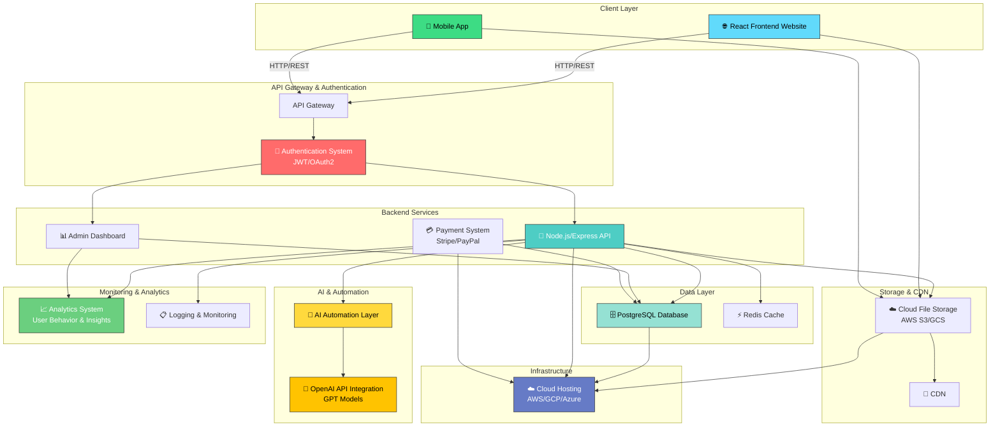

# Smart Balance Group - System Architecture

## Architecture Overview



---

## Component Descriptions

### Client Layer

#### 🌐 React Frontend Website
- **Purpose**: Main web application for the AI Academy and Company portal
- **Features**: Course browsing, user registration, learning dashboard, company information
- **Technology**: React, TypeScript, Tailwind CSS, Redux/Context for state management
- **Deployment**: CDN-hosted static files

#### 📱 Mobile App
- **Purpose**: Native or cross-platform mobile application
- **Features**: On-the-go learning, notifications, progress tracking, community features
- **Technology**: React Native or Flutter
- **Deployment**: App stores (iOS & Android)

---

### API Gateway & Authentication

#### API Gateway
- **Purpose**: Central entry point for all client requests
- **Features**: Request routing, rate limiting, load balancing
- **Technology**: NGINX or AWS API Gateway
- **Benefits**: Enhanced security, scalability, request filtering

#### 🔐 Authentication System
- **Purpose**: Secure user authentication and authorization
- **Standards**: JWT tokens, OAuth2 for social login
- **Features**: Multi-factor authentication, session management, role-based access control (RBAC)
- **Security**: Password hashing (bcrypt), secure token storage

---

### Backend Services

#### 🔧 Node.js/Express API
- **Purpose**: Core application server handling business logic
- **Endpoints**: User management, course management, progress tracking, content delivery
- **Features**: RESTful API design, real-time data updates via WebSockets
- **Performance**: Request validation, middleware for logging and error handling

#### 📊 Admin Dashboard
- **Purpose**: Management interface for administrators and instructors
- **Features**: User management, course creation, analytics review, system monitoring
- **Capabilities**: Bulk operations, reporting, content moderation
- **Access**: Restricted to authorized admin users

#### 💳 Payment System
- **Purpose**: Monetization and subscription management
- **Integration**: Stripe, PayPal, or similar payment providers
- **Features**: Course pricing, subscription plans, invoicing, refund handling
- **Security**: PCI compliance, secure transaction processing

---

### AI & Automation

#### 🤖 AI Automation Layer
- **Purpose**: Intelligent features and automation within the platform
- **Capabilities**: 
  - Personalized course recommendations
  - Automated content generation
  - Student performance analysis
  - Smart tutoring assistance
- **Processing**: Asynchronous job processing for heavy computations

#### 🧠 OpenAI API Integration
- **Purpose**: Leverage advanced language models for intelligent features
- **Use Cases**: 
  - AI-powered tutoring and Q&A
  - Automated course content creation
  - Assignment feedback and grading assistance
  - Natural language search capabilities
- **Cost Management**: Rate limiting and token optimization

---

### Data Layer

#### 🗄️ PostgreSQL Database
- **Purpose**: Primary relational database for all persistent data
- **Tables**: Users, courses, progress, transactions, content, analytics events
- **Features**: ACID compliance, robust query capabilities, data integrity
- **Scaling**: Replication and read replicas for performance

#### ⚡ Redis Cache
- **Purpose**: High-speed caching layer for frequently accessed data
- **Use Cases**: Session storage, course catalog caching, rate limiting counters
- **Benefits**: Reduced database load, faster response times

---

### Storage & CDN

#### ☁️ Cloud File Storage
- **Purpose**: Scalable storage for user-generated content and course materials
- **Content Types**: Video lectures, PDFs, images, documents
- **Service**: AWS S3, Google Cloud Storage, or Azure Blob Storage
- **Security**: Encrypted storage, access controls, versioning

#### 🚀 CDN (Content Delivery Network)
- **Purpose**: Global content distribution for optimal performance
- **Benefits**: Reduced latency, faster downloads, reduced bandwidth costs
- **Service**: CloudFlare, AWS CloudFront, or Akamai
- **Content**: Static assets, course videos, images

---

### Monitoring & Analytics

#### 📈 Analytics System
- **Purpose**: Track user behavior, engagement, and platform insights
- **Metrics**: 
  - User enrollment and completion rates
  - Course popularity
  - Learning paths effectiveness
  - Feature usage statistics
- **Visualization**: Dashboards for stakeholders and data-driven decisions

#### 📋 Logging & Monitoring
- **Purpose**: System health monitoring and troubleshooting
- **Stack**: ELK (Elasticsearch, Logstash, Kibana) or equivalent
- **Alerts**: Real-time notifications for critical issues
- **Debugging**: Centralized logs for error tracking and performance analysis

---

### Infrastructure

#### ☁️ Cloud Hosting
- **Provider**: AWS, Google Cloud Platform, or Azure
- **Services**: 
  - Compute (EC2/App Engine) for API servers
  - Managed databases (RDS/Cloud SQL)
  - Load balancers for distribution
  - Auto-scaling for traffic spikes
- **Deployment**: Docker containers, Kubernetes orchestration (optional)
- **Redundancy**: Multi-region deployment for high availability

---

## Data Flow

1. **User Request**: Clients (web/mobile) send requests to the API Gateway
2. **Authentication**: Gateway validates JWT tokens via the Authentication System
3. **Processing**: Express API processes requests, applies business logic
4. **Database Access**: Queries are executed against PostgreSQL with Redis caching
5. **AI Processing**: Complex operations trigger the AI Automation Layer and OpenAI API
6. **File Handling**: Media is stored in Cloud File Storage and served via CDN
7. **Analytics**: Events are logged to the Analytics System for insights
8. **Response**: Processed data is returned to clients in JSON format

---

## Security Considerations

- **Authentication**: JWT-based stateless authentication
- **Encryption**: TLS/SSL for data in transit, encryption at rest for sensitive data
- **Access Control**: Role-based access control (RBAC) for different user types
- **Rate Limiting**: Protection against brute force and abuse
- **Data Privacy**: GDPR compliance, secure data handling practices
- **PCI Compliance**: Secure payment processing through trusted providers

---

## Scalability Strategy

- **Horizontal Scaling**: Multiple API server instances behind load balancers
- **Database Optimization**: Connection pooling, query optimization, indexing
- **Caching Strategy**: Redis for session and frequently accessed data
- **Asynchronous Processing**: Job queues for heavy computations
- **CDN Distribution**: Global content delivery for reduced latency
- **Auto-scaling**: Cloud provider auto-scaling based on demand

---

## Deployment Architecture

```
├── Development Environment
├── Staging Environment (pre-production testing)
└── Production Environment
    ├── Multi-region deployment
    ├── Blue-green deployment strategy
    └── Automated CI/CD pipeline (GitHub Actions, GitLab CI, or Jenkins)
```

---

## Technology Stack Summary

| Layer | Technology |
|-------|-----------|
| Frontend | React, TypeScript, Tailwind CSS |
| Mobile | React Native / Flutter |
| Backend | Node.js, Express.js |
| Database | PostgreSQL, Redis |
| AI Integration | OpenAI API, Python (for ML models) |
| Storage | AWS S3 / Google Cloud Storage |
| CDN | CloudFlare / AWS CloudFront |
| Hosting | AWS / GCP / Azure |
| Monitoring | ELK Stack / DataDog |
| Analytics | Custom tracking / Mixpanel |
| Payment | Stripe / PayPal API |

---

## Future Enhancements

- Real-time collaboration features using WebSockets
- Machine learning model training pipeline for personalization
- Blockchain integration for certificate verification
- Advanced video streaming with adaptive bitrate
- Community and gamification features
- Mobile-first progressive web app (PWA)
- GraphQL API for flexible data querying
